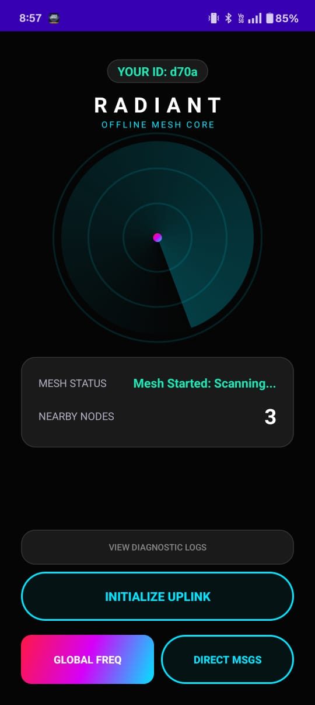
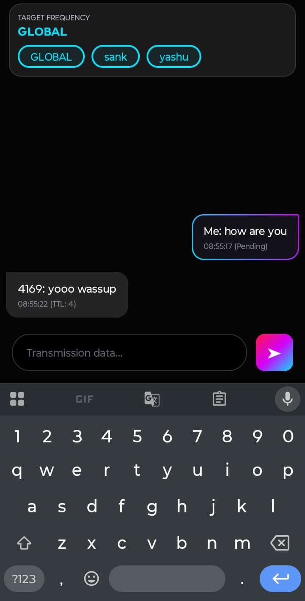
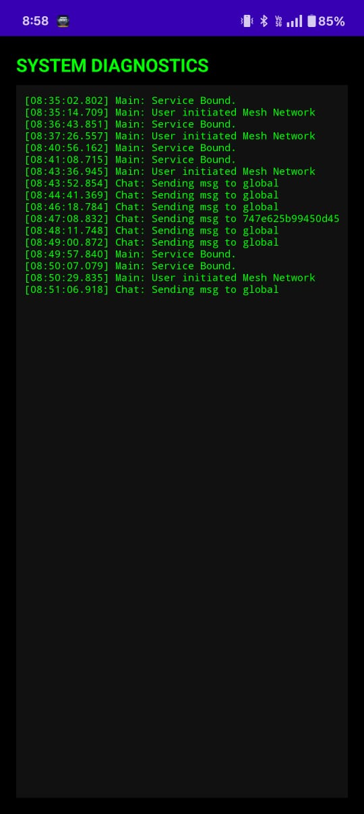

# RADIANT

RADIANT is an infrastructure-independent communication system that enables secure device-to-device messaging using Bluetooth Low Energy (BLE) mesh networking.  
The system operates entirely offline and propagates messages across multiple nodes using decentralized multi-hop routing.

---

# Architecture Overview

The system follows a layered architecture designed for decentralized communication, efficient routing, and secure message propagation.

```
+--------------------------------------------------+
|                Application Layer                 |
|        Messaging Interface / Client Logic       |
+--------------------------------------------------+
|                  Security Layer                  |
|        End-to-End Encryption / Identity         |
+--------------------------------------------------+
|                  Routing Layer                   |
|     Multi-Hop Propagation / Deduplication       |
|     TTL Management / Peer Selection             |
+--------------------------------------------------+
|              Store & Forward Layer               |
|      Local Message Queue / Retry Mechanism      |
+--------------------------------------------------+
|             Device Discovery Layer               |
|      BLE Advertising / Peer Detection           |
+--------------------------------------------------+
|                Transport Layer                   |
|           Bluetooth Low Energy (BLE)            |
|           GATT Communication Channels           |
+--------------------------------------------------+
```

---

# Message Flow

Messages propagate across the mesh using opportunistic forwarding between nearby nodes.

```
Sender Node
    |
Encrypt Message
    |
BLE Broadcast / Direct Send
    |
Neighbor Node Receives
    |
Check Message ID (Deduplication)
    |
Store in Local Queue
    |
Forward to Next Peer
    |
Repeat Until Destination
```

Key mechanisms:

- **Peer Discovery** – Devices discover nearby nodes via BLE advertisements.
- **Message Identification** – Unique message IDs prevent duplicate propagation loops.
- **Store & Forward** – Messages persist locally until a forwarding opportunity appears.
- **Energy Efficiency** – BLE advertising intervals minimize battery usage.

---
## Application Interface

### Home Screen
<p align="center">
  
</p>

### Secure Chat Interface
<p align="center">
  
</p>

### Network Diagnostics
<p align="center">
  
</p>
